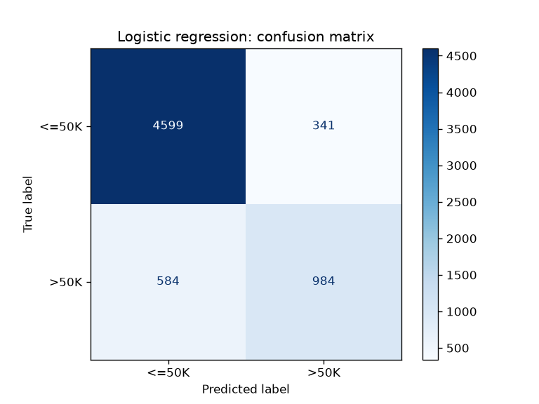
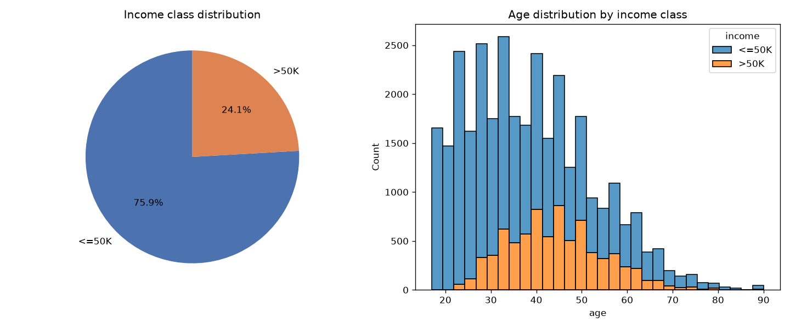

# Adult income analysis

Exploratory analysis of the [UCI Adult (Census Income)](https://archive.ics.uci.edu/dataset/2/adult)
dataset with **pandas**, the same analysis repeated with **polars**, a first
**logistic regression** model, and a timing comparison between the two libraries.

Each row is one person from the 1994 US census. The target column, `income`,
says whether the person earns more than 50K USD a year.

| | |
|---|---|
| rows | 32,561 (24 exact duplicates, 32,537 after removing them) |
| columns | 15: 6 numeric, 9 categorical (incl. the target) |
| missing values | 4,262 cells, all in `workclass`, `occupation` and `native_country`, written as `?` in the raw file |
| target balance | 75.9 % `<=50K`, 24.1 % `>50K` |

## Project layout

```
adult-income-analysis/
├── src/main.py               # the whole analysis as small functions and  main()
├── tests/test_main.py        # unit tests
├── notebooks/
│   ├── adult_income_analysis.ipynb   # same steps cell by cell, outputs saved
│   └── rust_vs_python_intro.ipynb    # short Rust ownership experiments
├── figures/                  # plots written by src/main.py
├── data/                     # adult.data is downloaded here on first run
├── requirements.txt
├── pyproject.toml            # ruff and pytest configuration
├── Makefile                  # install / lint / format / test / run / docker-*
├── Dockerfile
└── .github/workflows/test.yml
```

## How to run

```bash
python -m venv .venv && source .venv/bin/activate
make install        # pip install -r requirements.txt
make run            # python src/main.py  (downloads the data on first run)
make check          # ruff lint + format check + pytest
```

Prefer an interactive walkthrough? Open `notebooks/adult_income_analysis.ipynb` in Jupyter or
VS Code. It runs the same steps cell by cell with the intermediate tables and plots visible,
and its outputs are saved so it can be read without running it. The script in `src/` is the
reference version that the tests and CI check.

Inside Docker:

```bash
make docker-build
make docker-run     # runs the analysis
make docker-test    # runs the test suite
```

## Steps

### 1. Import the dataset

`download_data()` fetches the raw CSV from UCI once and caches it under `data/`.
`load_pandas()` and `load_polars()` read that file. The raw file has three
quirks that both loaders have to handle the same way:

* there is no header row, so the 15 column names are supplied by hand;
* every value after a comma starts with a space, and missing values are `?`;
* the file ends with a blank line. pandas skips it; polars reads it as a row
  of nulls, so the polars loader drops all-null rows.

### 2. Inspect the data

`inspect_pandas()` prints `head()`, `info()` and `describe()` and returns the
row, missing and duplicate counts. Findings:

* six integer columns and nine text columns, no wrong dtypes;
* `capital_gain` and `capital_loss` are zero for most people and have a long
  tail (max 99,999 and 4,356);
* median age is 37, median hours per week is 40;
* 24 exact duplicate rows, removed by `clean_pandas()` / `clean_polars()`.

### 3. Basic filtering and grouping

* **Filter:** people working more than 40 hours a week: 9,576 of 32,537 (29 %).
* **Group by education** (`group_by_education_*`): count, mean hours per week,
  mean capital gain and the share earning more than 50K.

| education | count | mean hours/week | mean capital gain | share >50K |
|---|---:|---:|---:|---:|
| Doctorate | 413 | 47.0 | 4,770 | 0.74 |
| Prof-school | 576 | 47.4 | 10,414 | 0.73 |
| Masters | 1,722 | 43.8 | 2,564 | 0.56 |
| Bachelors | 5,353 | 42.6 | 1,757 | 0.41 |
| Assoc-voc | 1,382 | 41.6 | 715 | 0.26 |
| Some-college | 7,282 | 38.9 | 600 | 0.19 |
| HS-grad | 10,494 | 40.6 | 577 | 0.16 |
| 11th | 1,175 | 33.9 | 215 | 0.05 |
| Preschool | 50 | 36.4 | 916 | 0.00 |

(Full table is printed by `make run`.) The share of high earners rises almost
monotonically with education level, and the highest levels also work the
most hours. The polars version returns the same table.

### 4. Machine learning: logistic regression

The target is binary, so logistic regression is a natural first model.
`build_model()` is a scikit-learn pipeline: numeric columns are standardised,
categorical columns are one-hot encoded, then a `LogisticRegression` is fit.
`train_and_evaluate()` uses a stratified 80/20 split with a fixed seed.

| | precision | recall | f1 | support |
|---|---:|---:|---:|---:|
| `<=50K` | 0.89 | 0.93 | 0.91 | 4,940 |
| `>50K` | 0.74 | 0.63 | 0.68 | 1,568 |
| **accuracy** | | | **0.858** | 6,508 |

The model does well on the majority class but misses 37 % of the high
earners. Because the classes are imbalanced, accuracy alone is misleading; the
next things to try are `class_weight="balanced"`, a tree-based model, and
dropping `fnlwgt` (a survey weight, not a personal attribute).



### 5. Visualisation

`plot_income_by_age()` writes `figures/income_by_age.png`: a pie of the target
classes and a stacked histogram of age by income class. High earners are
concentrated between roughly 35 and 55; almost nobody under 25 earns more
than 50K.



### 7. pandas vs polars

`benchmark()` runs the same four operations with both libraries and reports the
best of five runs. Filtering and grouping run on the dataset repeated 50 times
(1.63 million rows) so the timings are large enough to compare.

| operation | pandas (ms) | polars (ms) | speed-up |
|---|---:|---:|---:|
| read_csv (32k rows) | 28.2 | 13.9 | 2.0x |
| drop duplicates (32k rows) | 10.7 | 4.2 | 2.5x |
| filter hours > 40 (1.63M rows) | 69.6 | 12.5 | 5.6x |
| group_by education (1.63M rows) | 711.9 | 16.3 | 43.7x |

Measured on one laptop, single run; absolute numbers will differ on other
machines but the ordering is stable.

Observations:

* polars is faster on every operation, and the gap grows with the size of the
  data and the amount of work per row. Group-by is where it shines: polars
  runs the aggregation in parallel on all cores, pandas is single-threaded.
* the code differs in style. pandas is eager and index-based; polars uses
  expressions (`pl.col(...)`) that it can plan and optimise before running.
* pandas is still more convenient at the edges: it stripped the spaces and
  skipped the blank line for free, and scikit-learn takes a pandas frame
  directly. In this project polars is used for the data steps and the model
  is trained on pandas.

## Rust ownership notebook

`notebooks/rust_vs_python_intro.ipynb` is a separate small exercise: five short experiments
with Rust's ownership rules (immutable by default, one owner per value, borrow or move,
never read and write at once), each built around a loop over hours worked per week.
Cells marked *fails on purpose* keep their compiler error as output, and the next cell shows
the fix. It needs the evcxr Rust kernel; outputs are saved so it can be read without one.

## Tests, linting and CI

* `tests/test_main.py` covers every function on a six-row sample that mimics
  the real file (leading spaces, a `?`, a duplicate row, a trailing blank
  line). It also checks that the pandas and polars group-by give the same
  numbers. The tests never download anything.
* `ruff` checks and formats `src/` and `tests/` (configured in `pyproject.toml`).
* `.github/workflows/test.yml` runs lint, format check, the tests, and the tests
  again inside the Docker image on every push and pull request.

## Further reading

**Dataset**
* [Adult (Census Income) on the UCI repository](https://archive.ics.uci.edu/dataset/2/adult): source, column descriptions, citation.

**pandas**
* [User guide](https://pandas.pydata.org/docs/user_guide/index.html), in particular
  [group by](https://pandas.pydata.org/docs/user_guide/groupby.html) and
  [working with missing data](https://pandas.pydata.org/docs/user_guide/missing_data.html).
* [10 minutes to pandas](https://pandas.pydata.org/docs/user_guide/10min.html) for a quick refresher.

**polars**
* [User guide](https://docs.pola.rs/): the [expressions](https://docs.pola.rs/user-guide/concepts/expressions-and-contexts/)
  chapter explains the `pl.col(...)` style used here.
* [Coming from pandas](https://docs.pola.rs/user-guide/migration/pandas/): side-by-side translation of common operations.
* [Python API reference](https://docs.pola.rs/api/python/stable/reference/index.html).

**scikit-learn**
* [Pipelines and composite estimators](https://scikit-learn.org/stable/modules/compose.html):
  `Pipeline` and `ColumnTransformer` as used in `build_model()`.
* [Logistic regression](https://scikit-learn.org/stable/modules/linear_model.html#logistic-regression) and
  [classification metrics](https://scikit-learn.org/stable/modules/model_evaluation.html#classification-metrics).

**Plotting**
* [Matplotlib quick start](https://matplotlib.org/stable/users/explain/quick_start.html) and
  [seaborn tutorial](https://seaborn.pydata.org/tutorial.html).

**Rust**
* [The Rust Programming Language](https://doc.rust-lang.org/book/), chapter 4
  [Understanding Ownership](https://doc.rust-lang.org/book/ch04-00-understanding-ownership.html)
  covers everything in the Rust notebook.
* [Rust by Example: ownership and borrowing](https://doc.rust-lang.org/rust-by-example/scope.html).
* [evcxr Jupyter kernel](https://github.com/evcxr/evcxr/tree/main/evcxr_jupyter): install instructions for running Rust in a notebook.

**Tooling**
* [ruff](https://docs.astral.sh/ruff/) (linter and formatter), [pytest](https://docs.pytest.org/en/stable/getting-started.html),
  [GitHub Actions for Python](https://docs.github.com/en/actions/use-cases-and-examples/building-and-testing/building-and-testing-python),
  [Dockerfile reference](https://docs.docker.com/reference/dockerfile/).
