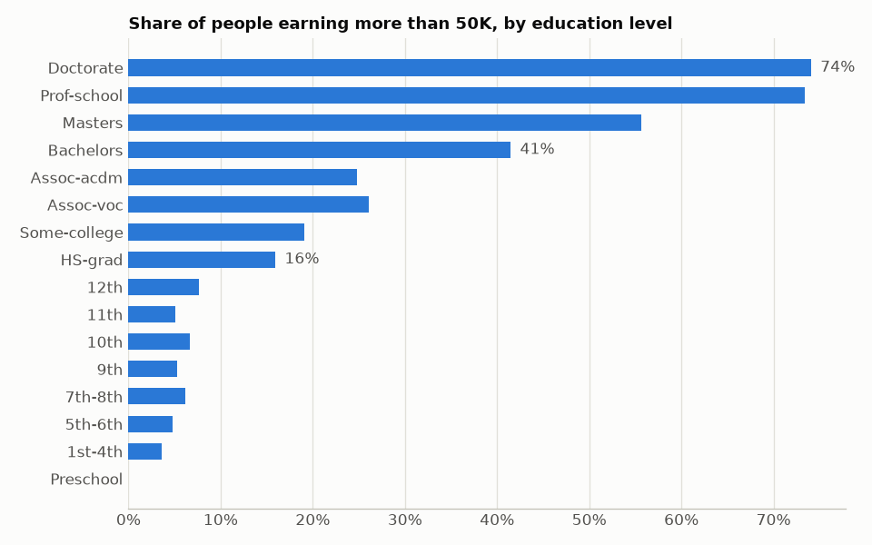
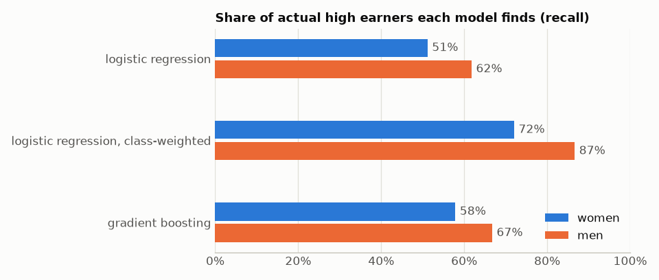
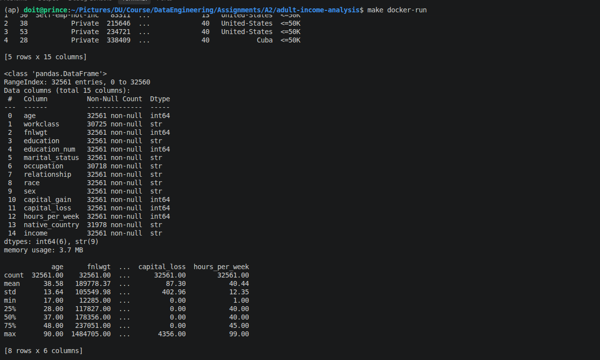
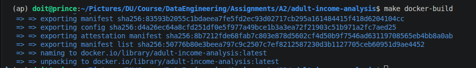
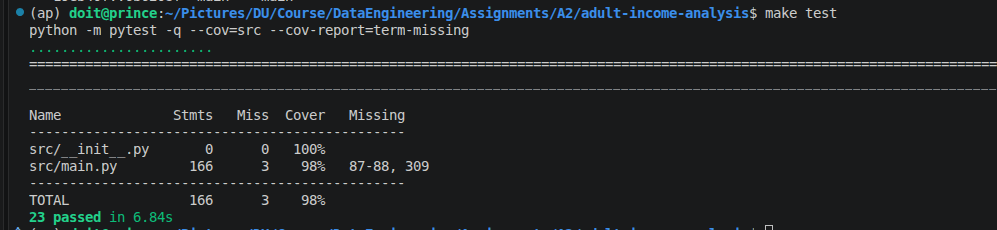
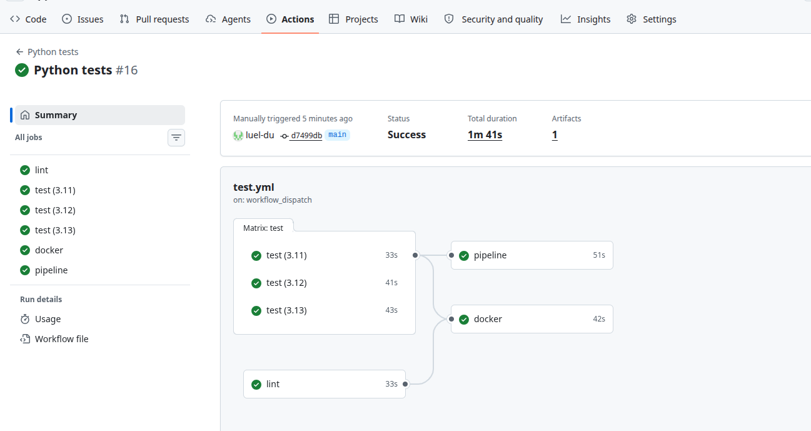
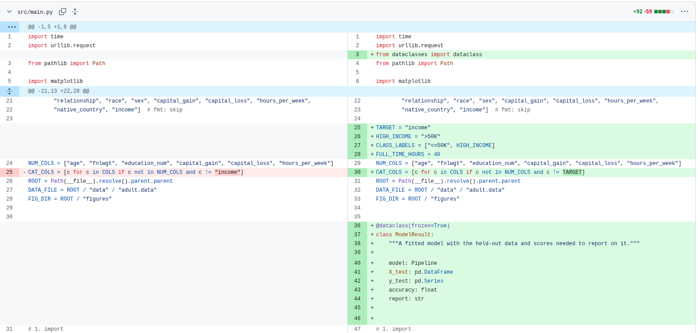

[](https://github.com/luel-du/adult-income-analysis/actions/workflows/test.yml)


# Adult income analysis

**Who earns more than 50K a year, how well can a model predict it, and does the model work
equally well for women and men?**

Income predictions are used in lending, marketing and policy. A model that looks accurate
overall can still fail one group more often than another, so this project checks both. The data
is the [UCI Adult](https://archive.ics.uci.edu/dataset/2/adult) extract of the 1994 US census:
32,561 people, 14 attributes, and whether each person earns more than 50K USD.

## Key findings

1. **Education is the clearest dividing line.** 74 % of people with a doctorate earn more than
   50K, against 16 % of high-school graduates and under 8 % of those who did not finish school.
2. **Gradient boosting is the best of three models** at 87 % accuracy. Plain logistic regression
   misses 40 % of the high earners. Class weighting finds 84 % of them, but its precision drops
   from 73 % to 57 %.
3. **Every model finds fewer of the high-earning women than of the high-earning men**, by 9 to
   15 points. The overall accuracy hides this completely.
4. **Polars is 2 to 11 times faster than pandas** on the same operations.

 

## Quick start

```bash
python -m venv .venv && source .venv/bin/activate
make install     # exact versions from requirements.txt
make run         # full analysis; downloads the data on first run, about 15 seconds
make check       # lint, format check, tests
```

No Python installed? Use [Docker](#docker). Prefer to read along cell by cell? Open
[`notebooks/adult_income_analysis.ipynb`](notebooks/adult_income_analysis.ipynb): it calls the
same functions as the script and its outputs are saved.

## Data preparation

The raw file has no header, a space after every comma, `?` for missing values and a trailing
blank line. Both loaders handle this, and a test checks that pandas and polars agree row for row.
Every decision below is backed by a report the script prints (`missing_value_report()`,
`top_coded_report()`).

| issue | what the data shows | decision |
|---|---|---|
| 24 exact duplicate rows | | removed |
| `occupation` missing in 1,843 rows, `workclass` in 1,836 of the same rows | only 10 % of these people earn more than 50K, against 24 % overall, so the gaps are **not random** | kept and labelled `Unknown`; dropping them would bias the data |
| `native_country` missing in 583 rows | 25 % high earners, the same as overall | same label, for consistency |
| `capital_gain` is exactly 99,999 for 159 people; the next value is 41,310 | a cap applied by the survey; all 159 are high earners | kept unchanged. A log transform was tested and lowered accuracy from 85.1 % to 84.4 %, so it is not used |
| `age` 90 (43 people), `hours_per_week` 99 (85 people) | also caps | kept |
| `fnlwgt` | a survey weight, not a fact about the person | excluded from the model |
| `education` | repeats `education_num` | excluded from the model |

## Results

### Models

Each model is scored with 5-fold cross-validation, so every person is predicted by a model that
never saw them. Precision, recall and F1 are for the `>50K` class. Recall is the share of actual
high earners the model finds.

| model | accuracy | precision | recall | F1 | recall, women | recall, men |
|---|---:|---:|---:|---:|---:|---:|
| logistic regression | 85.1 % | 73.4 % | 60.2 % | 0.661 | 51.1 % | 61.8 % |
| logistic regression, class-weighted | 81.0 % | 57.2 % | 84.4 % | 0.682 | 72.0 % | 86.6 % |
| gradient boosting | **87.1 %** | **77.7 %** | 65.4 % | **0.710** | 57.8 % | 66.7 % |

The gap between women and men is measured on 1,179 high-earning women and 6,660 high-earning
men, so it is not noise. In the data itself 11 % of women and 31 % of men earn more than 50K,
and the models reproduce that imbalance rather than correct it. Class weighting raises recall
for both groups but leaves the widest gap.

### pandas vs polars

Same operations, best of five runs, pandas 3.0 and polars 1.44. Filter and group-by run on the
data repeated 50 times.

| operation | pandas (ms) | polars (ms) | speed-up |
|---|---:|---:|---:|
| read_csv, 32,561 rows | 40.7 | 17.2 | 2.4x |
| clean, 32,561 rows | 29.8 | 6.3 | 4.7x |
| filter, 1.63 M rows | 57.3 | 12.4 | 4.6x |
| group_by, 1.63 M rows | 191.2 | 17.6 | 10.9x |

Timings are from one laptop and vary a little between runs. Polars wins most on the group-by,
which it runs in parallel on all cores. Pandas is still more convenient at the edges: it strips
the spaces and skips the blank line for free, and scikit-learn takes its frames directly.

## Takeaways

* **Look before you impute.** The missing values here carried information. Counting them was
  not enough; comparing the outcome inside and outside the gaps decided the treatment.
* **One accuracy number is not an evaluation.** The best model by accuracy still finds only
  58 % of the high-earning women.
* **Benchmarks age.** With pandas 2.2 the group-by gap was 25x to 50x across my runs. Upgrading
  to pandas 3.0 cut it to about 11x with no change to the code.
* **"Works on my machine" is real.** A test passed locally and failed in CI because of a package
  that was installed on the laptop but never declared. Pinned versions, CI and Docker exist to
  catch exactly that.

## Project layout

```
src/main.py                         the analysis: small functions and a four-line main()
tests/test_main.py                  23 tests, no network needed
notebooks/adult_income_analysis.ipynb   the same analysis, cell by cell
notebooks/rust_vs_python_intro.ipynb    Rust ownership experiments (side exercise)
figures/                            charts written by the script, and screenshots
requirements.txt                    exact dependency versions
Makefile                            install, lint, format, test, check, run, docker-*
Dockerfile, .github/workflows/test.yml, pyproject.toml
```

Results are reproducible: dependency versions are pinned, the cross-validation folds and the
gradient boosting model use a fixed seed, and the downloaded data file is cached in `data/`.

## Docker

```bash
make docker-build   # docker build -t adult-income-analysis .
make docker-run     # run the analysis; figures/ and data/ appear on your machine
make docker-test    # run the test suite inside the image
```

What I learned building it:

* **A container's files disappear with it.** The first version wrote the charts inside the
  container and `--rm` deleted them. Mounting `figures/` and `data/` as volumes fixed that.
* **Layer order is a cache strategy.** Dependencies are installed before the code is copied, so
  editing `src/` rebuilds in seconds.
* **Do not run as root.** The image has an unprivileged user, and `--user` makes the output
  files belong to the host user.
* **CI builds the same image** and runs the tests inside it on every push.


 

## Tests and CI

```bash
make test      # 23 tests with a coverage report (98 % of src/main.py)
```

The tests are grouped by pipeline step, plus one system test that runs `main()` end to end.
They use a six-row sample in the exact format of the UCI file, so nothing needs the network.
Edge cases include the trailing blank line, a report with nothing missing, a filter that matches
nothing, a category unseen in training, and a group with no high earners.

`.github/workflows/test.yml` runs on every push and pull request:

| job | what it does |
|---|---|
| `lint` | `ruff check` and `ruff format --check` |
| `test` | tests with coverage on a **matrix** of Python 3.11, 3.12 and 3.13 |
| `docker` | builds the image and runs the tests inside it, after `lint` and `test` pass |
| `pipeline` | full analysis on the real UCI data, figures uploaded as an artifact; **scheduled** weekly, not on every push |

The weekly run exists because the data is downloaded from UCI, which can change or go offline
without any commit here. It is the one place where the real download is exercised.

 

## Refactoring

After the first version worked, `src/main.py` was refactored without changing what it computed.
Formatting and linting are done by `ruff`, which covers the roles of `black` and `flake8`.

| before | after | why |
|---|---|---|
| `inspect_pandas(df, verbose=True)` computed counts and printed, switched by a flag | `summarize()` returns the counts, `print_overview()` prints | one job per function |
| the model function returned a dict with five string keys | a frozen `ModelResult` dataclass | a mistyped field fails immediately |
| `"income"`, `">50K"` and `40` typed out across the file | constants `TARGET`, `HIGH_INCOME`, `FULL_TIME_HOURS` | one place to change; the names say what the values mean |
| both plot functions repeated the same mkdir, save, close lines | `_save_figure()` | duplicated code removed |
| `main()` ran every step in one block | `explore()` and `model_and_plot()`, leaving a four-line `main()` | `main()` reads as the pipeline |
| benchmark labels hard-coded "32k rows" | labels computed from the data | the label was wrong for any other input |

**How I checked that nothing broke:** the 16 existing tests passed before and after. I also ran the full
pipeline on the real data before and after: all 117 lines of analysis output were identical and
both figures were byte-for-byte the same. The model comparison was added later, on top of the
refactored code.



## Further reading

| topic | links |
|---|---|
| Dataset | [UCI Adult](https://archive.ics.uci.edu/dataset/2/adult) |
| pandas | [user guide](https://pandas.pydata.org/docs/user_guide/index.html) · [group by](https://pandas.pydata.org/docs/user_guide/groupby.html) · [missing data](https://pandas.pydata.org/docs/user_guide/missing_data.html) |
| polars | [user guide](https://docs.pola.rs/) · [expressions](https://docs.pola.rs/user-guide/concepts/expressions-and-contexts/) · [coming from pandas](https://docs.pola.rs/user-guide/migration/pandas/) |
| scikit-learn | [pipelines](https://scikit-learn.org/stable/modules/compose.html) · [cross-validation](https://scikit-learn.org/stable/modules/cross_validation.html) · [metrics](https://scikit-learn.org/stable/modules/model_evaluation.html#classification-metrics) · [gradient boosting](https://scikit-learn.org/stable/modules/ensemble.html) |
| Rust | [ownership chapter](https://doc.rust-lang.org/book/ch04-00-understanding-ownership.html) · [Rust by Example](https://doc.rust-lang.org/rust-by-example/scope.html) · [evcxr kernel](https://github.com/evcxr/evcxr/tree/main/evcxr_jupyter) |
| Tooling | [ruff](https://docs.astral.sh/ruff/) · [pytest](https://docs.pytest.org/en/stable/getting-started.html) · [GitHub Actions](https://docs.github.com/en/actions/use-cases-and-examples/building-and-testing/building-and-testing-python) · [Dockerfile](https://docs.docker.com/reference/dockerfile/) |
